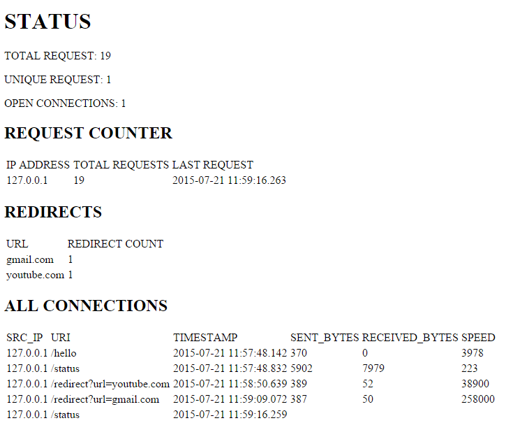
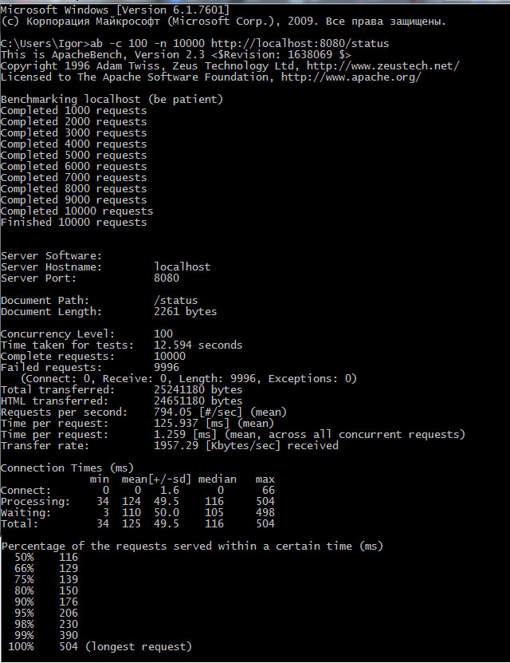
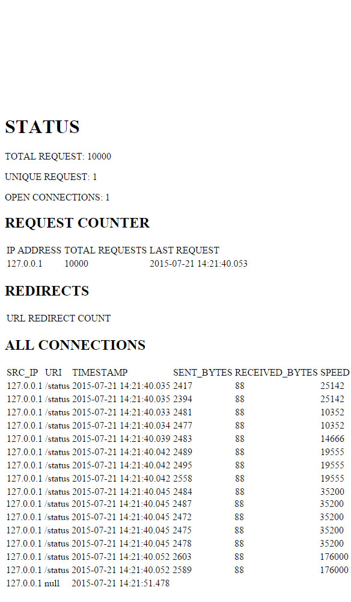

# NettyProject
# Implementation
Class HttpServer is responsible for creating a channel (channel is bound to 8080 port number).
HttpServerInitializer class creates an instance of ChannelPipeline class and bind handlers to it.
There are two hanlers: HttpServerHandler and HttpChannelTrafficShapingHandler.
Last one is used for accounting connection's traffic.
HttpServerHandler class handles all business logic. There is a method "invokeRightMethod" which decide (based on incomming ulr address) how to respond (which method to invoke).
TotalInformation class contains all the information about server's work.
FullRequest and Request classes are used for saving data in it.

# Results

